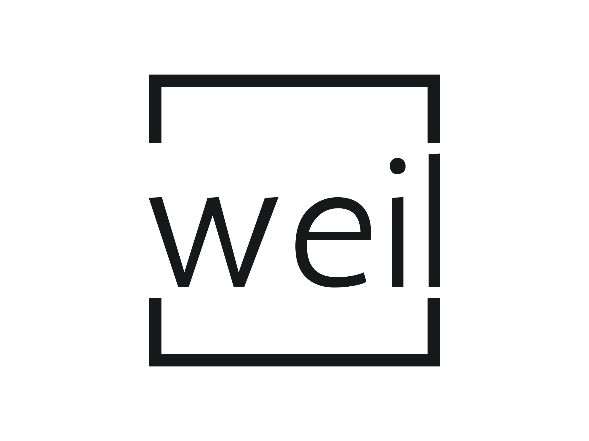

# Weil: Decentralized Voting System



Weil is a decentralized voting platform aiming to revolutionize national elections, making them transparent, secure, and accessible to all. Inspired by Simone Weil's commitment to social justice and her emphasis on the value of every individual, our mission is to provide a trustworthy and inclusive voting system for the digital age.

## Table of Contents

- [Weil: Decentralized Voting System](#weil-decentralized-voting-system)
  - [Table of Contents](#table-of-contents)
  - [Features](#features)
  - [Getting Started](#getting-started)
    - [Prerequisites](#prerequisites)
    - [Installation](#installation)
  - [Usage](#usage)
  - [Contribute](#contribute)
  - [Security](#security)
  - [Roadmap](#roadmap)
  - [License](#license)
  - [Credits](#credits)

## Features

- **Transparency**: Every vote is recorded on a public ledger, allowing for full verifiability.
- **Security**: Utilizing the power of blockchain technology, Weil ensures that once a vote is cast, it's immutable.
- **Accessibility**: Empowering citizens to cast their votes from anywhere in the world.
- **Privacy**: Designed with voter anonymity at its core. Your vote is transparent, but your identity is protected.

## Getting Started

### Prerequisites

- Node.js (v14+)
- Avalanche C-Chain development environment (e.g., Truffle, Ganache)
- MetaMask or another web3 provider

### Installation

1. Clone the repository:

```sh
git clone https://github.com/your-github-username/weil.git
```

2. Navigate to the project directory:

```sh
cd weil
```

3. Install dependencies:

```sh
npm install
```

4. Deploy the smart contracts:

```sh
truffle migrate
```

## Usage

1. Start the local development server:

```sh
npm start
```


2. Open your browser and navigate to `http://localhost:3000`.

3. Follow the on-screen instructions to cast your vote!

## Contribute

We welcome contributions from the community. Please read our [CONTRIBUTING.md](link-to-contributing-md) for guidelines.

## Security

Security is our top priority. If you discover any issues, please refer to our [SECURITY.md](link-to-security-md) and report them responsibly.

## Roadmap

- Q1 2024: Prototype development and initial testing.
- Q2 2024: Public testnet launch.
- Q3 2024: Incorporate feedback and iterate.
- Q4 2024: Mainnet launch and first pilot election.

For a detailed roadmap, please check our [ROADMAP.md](link-to-roadmap-md).

## License

This project is licensed under the MIT License. See [LICENSE](link-to-license) for more details.

## Credits

Inspired by Simone Weil's philosophy and dedication to the collective good. Special thanks to all contributors and supporters.
